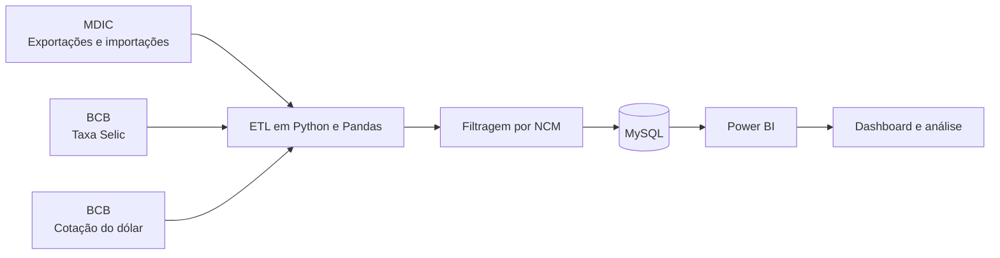

# Comércio Exterior Brasileiro

## Uma análise de dados dos impactos da Taxa Selic e do câmbio em produtos estratégicos

## Sobre o projeto

Este projeto acadêmico aplica técnicas de Ciência de Dados para investigar a relação entre a Taxa Selic, a cotação do dólar e o comércio exterior brasileiro. A análise considera o período de **2018 a 2025** e quatro grupos de produtos estratégicos:

- minério de ferro;
- soja;
- petróleo;
- máquinas e equipamentos.

O estudo combina dados públicos de comércio exterior e indicadores macroeconômicos para identificar padrões, tendências e possíveis relações entre juros, câmbio, exportações e importações.

## Questão de pesquisa

> Como técnicas de Ciência de Dados — incluindo ETL, análise exploratória e visualização interativa — podem ser empregadas para identificar e quantificar a relação entre a Taxa Selic, o câmbio e o desempenho do comércio exterior de produtos estratégicos brasileiros?

## Pipeline de dados

### Etapas principais

1. **Extração:** coleta de arquivos CSV do MDIC, série histórica da Selic e cotações do dólar fornecidas pelo Banco Central.
2. **Transformação:** limpeza, padronização de colunas, tratamento de datas e filtragem pelos códigos NCM dos produtos selecionados.
3. **Carga:** armazenamento dos dados tratados em tabelas relacionais no MySQL.
4. **Modelagem:** relacionamento das tabelas comerciais, cambiais e de juros pelo período analisado.
5. **Visualização:** criação de medidas DAX e dashboards interativos no Power BI.

## Tecnologias utilizadas

- **Python e Pandas:** processamento, limpeza e integração dos dados;
- **SQL e MySQL:** armazenamento e consultas em banco de dados relacional;
- **Power BI:** modelagem, medidas DAX e visualização dos resultados;
- **NCM:** seleção dos grupos de produtos analisados;
- **ETL:** integração de dados heterogêneos em CSV e JSON.

## Fontes de dados

- Ministério do Desenvolvimento, Indústria, Comércio e Serviços — **MDIC**;
- Banco Central do Brasil — **Taxa Selic**;
- Banco Central do Brasil — **cotação do dólar**.

## Principais resultados

- Os quatro grupos analisados apresentaram **superávit comercial acumulado de aproximadamente R$ 482,30 bilhões**.
- O saldo comercial atingiu um pico próximo de **R$ 100 bilhões em 2023**.
- As exportações de commodities cresceram de forma expressiva a partir de 2021.
- O comportamento das importações mostrou relação com o ambiente de juros, embora o período pós-pandemia tenha produzido movimentos fora do padrão esperado.
- A variação cambial, isoladamente, não foi suficiente para explicar o desempenho das exportações.
- A pandemia foi identificada como o principal fator de ruptura no período, com efeitos relevantes sobre a demanda internacional e os fluxos comerciais.

## Limitações

A análise é exploratória e descritiva. As relações observadas foram avaliadas principalmente por comparação visual, sem testes estatísticos formais de correlação ou causalidade. O modelo também mantém alguns códigos de país e via de transporte sem dimensões descritivas e utiliza o modo de importação do Power BI, que exige atualização manual dos dados.

## Artigo completo

O relatório acadêmico com a fundamentação teórica, metodologia, desenvolvimento do pipeline, dashboards, resultados e referências está disponível em:

📄 [Baixar o artigo em Word](./artigo%20vFinal.docx)

## Autores

- Grazielly dos Santos da Costa
- João Vitor da Silva Maia
- Miguel Silva Pereira
- Murilo Teixeira Roque Banuis

Projeto desenvolvido na **FATEC Baixada Santista — Rubens Lara**.

## Licença

Este repositório está licenciado conforme o arquivo [LICENSE](./LICENSE).
